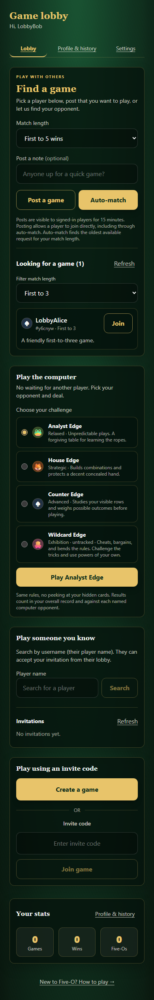
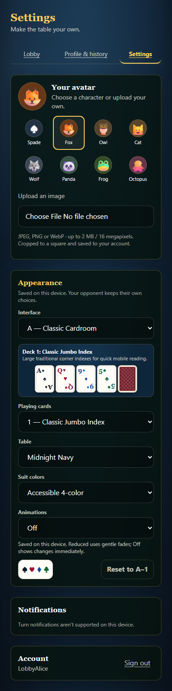

# Game lobby and settings

Implemented, locally verified, and deployed to https://edgegames.win on
September 8, 2026. This repository includes the deployed source snapshot;
the deployment did not push a Git release.

## Player workflow

- Signing in opens `/lobby`; anonymous visitors keep the public home page.
- Post a game with an optional note and first-to-1, 3, or 5 wins. Signed-in
  players can filter the available posts and join directly.
- Auto-match pairs the oldest compatible public post or automatic search.
  A new public post can also satisfy a waiting automatic search.
- Public posts expire after 15 minutes. Automatic searches renew every 20
  seconds while the lobby is visible, and expire after 90 seconds without
  renewal. A cancellation removes the request immediately.
- The lobby checks for updates every five seconds while visible. Both players
  open the same saved game. A matched notice remains available after reload;
  clearing it never deletes the match.
- `/settings` provides avatars, appearance, motion, notifications, and sign-out.
  Profile and history have their own page. In-game quick settings remain usable.

## Persistence and boundaries

`GameRequest` stores one current intent per user. Request IDs change when an
expired or cleared request is replaced, so a stale tab cannot cancel its
replacement. Two conditional request claims and match creation commit together.
Retries do not create a second match; failed match creation rolls back both
claims. The existing single-replica SQLite deployment remains required.

The API authenticates every operation, limits request rates and body size,
validates match lengths and notes, and returns only public player identity data.
Invite codes appear only in the matched participants' own snapshots. Automatic
searches are excluded from the public list. The list returns the oldest 50
matching posts and the total count; it supports a match-length filter.

This is matching by availability and match length, without a skill-rating system.
Posting authorizes direct joining and auto-matching; no further invitation
acceptance is required. A player can keep multiple saved games, but has only one
current lobby request. An auto-search may remain eligible for up to 90 seconds
after its tab becomes hidden or closes.

## Validation

Verified with Node 22.23.2:

- ESLint and TypeScript checks passed.
- All 243 tests in 29 files passed. The 25 lobby/API cases were rerun after the
  final response-race fix and passed.
- Production Next.js build passed with `/lobby`, `/settings`, and `/api/lobby`.
- Schema validation and migration verification passed for fresh databases,
  both released player-feature and computer-opponent schemas, legacy db-push,
  the supported delta-only predecessor, and rejection of orphaned data.
- Two isolated browser accounts posted, filtered, joined, and auto-matched into
  live game boards. Tests also covered cancellation, expiry, refresh failure and
  recovery, and a match formed before the original search response arrives.
- Avatar and device appearance/motion choices persisted across reload.
- Both pages fit 320, 390, 768, and 1280px widths without horizontal overflow.
  Screenshots were visually inspected; no browser page errors occurred.

The bounded browser runner and machine-readable results are local artifacts at
`.Codex/qa-lobby.cjs` and `.Codex/lobby-qa/results.json`. Its database is isolated
from existing accounts and its server is stopped after verification.

## Deployment

The additive migration is `20260908000000_game_lobby`. Before deploying, stop
the sole application writer, back up the existing SQLite data using the normal
deployment procedure, and run `npm run db:migrate`. The guarded migration
recognizes the existing five-migration release, preserves its saved games and
computer identities, and verifies the final schema. No existing database was
upgraded during local implementation. The production upgrade subsequently
completed on September 8, 2026 at approximately 17:51 America/New_York.

The production app and Cloudflare Tunnel are healthy. Public checks verified
sign-in to `/lobby`, the private listing API, `/settings`, and authenticated
WebSockets. Anonymous private API and WebSocket access remained blocked. All
123 checked application source and migration files match the local release;
dependency versions and integrity hashes also match. No browser errors occurred.
Temporary verification accounts were removed, and unrelated containers were
preserved.

The stopped-writer backup was checked file-for-file against the complete data
volume. Every pre-existing application table retained its row count and content
digest after migration; SQLite integrity and foreign-key checks passed. The
backup is `backups/pre-lobby-20260908-175001`, and the prior image is retained as
`five-o-poker:rollback-pre-lobby-20260908`.

Deployment receipt: `.Codex/deployment-lobby-20260908.json`.
Release image: `five-o-poker:lobby-20260908`.
